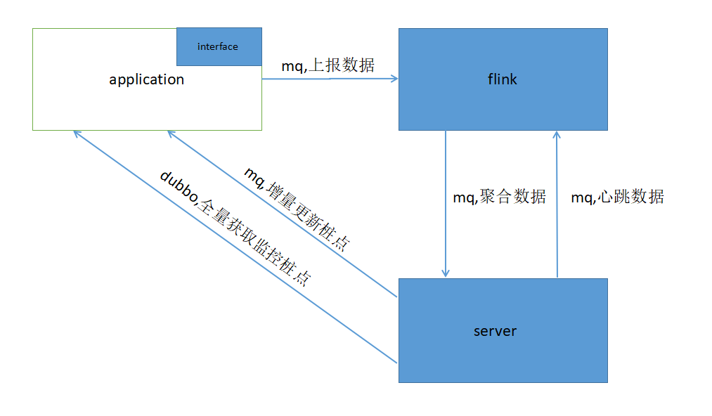
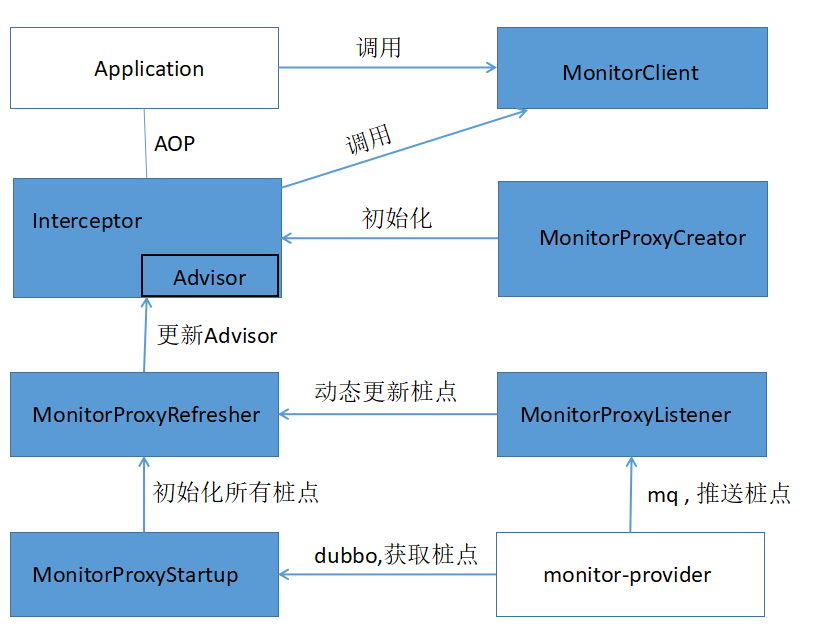
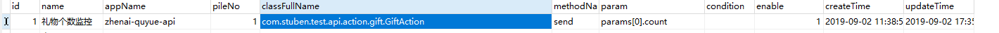
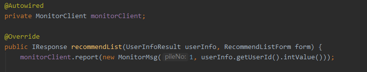
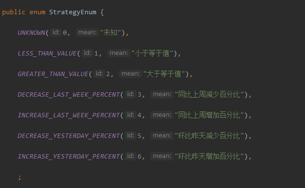

## 架构

- interface: 主要负责数据采集工作 , 使用Spring AOP将桩点织入到方法中, 在方法执行成功之后执行
- flink : 主要对采集到的原始数据进行实时计算, 每分钟聚集一次 , 并且每天会触发一次统计 , 统计当天的最大/最小/平均值
- server: 主要负责桩点和告警的配置 , 负责将桩点同步到interface , 对来自flink的数据进行存储和告警

## 数据采集 

- 桩点编织
  - 目前使用Spring AOP , 在程序启动的时候 , 将常用的类转换成其代理类(支持80%以上的Bean , 包括Action , Mapper , Service , Facade , Async) 
- 采集上报
  - 目前有两种方式进行采集上报:
    1. 使用MonitorProxyInfo这张表进行自动上报, 配置字段包括: 应用 , 桩号 , 类名 , 方法名 , 参数 , 条件 等 , 可以在运行期间织入, 对代码无侵入性 , 如:
    
    2. 使用MonitorClient进行手动上报, 对代码有侵入性 , 如: 
     
    (ps : 建议将手动上报的桩号pileNo也填入到MonitorProxyInfo表中 , classFullName为空就不会自动同步了 , 这样有利于维护)

## 数据聚集

- 聚集维度
  - 数据聚集的两个时间维度为: “每分钟”和”每天”;
  - 每分钟的数据为采集上报数据的总和 , 每分钟统计一次;
  - 每天的数据为每分钟数据的平均值/最大值/最小值 , 每天统计一次
- 数据完整性
  - 使用Flink的Checkpoints来保证集群节点奔溃时数据的完整性;
  - 使用Flink的Savepoints来保证任务重启时的数据

## 监控中心
- 桩点配置
  - 如”数据采集”一章说的 , 会根据MonitorProxyInfo表的信息将配置信息同步给采集端, 全量同步采用暴露Dubbo服务的方式, 增量同步使用RocketMQ进行推送
- 数据储存
  - 数据存储现在不会存储采集到的原数据, 现在只存储了”数据聚集”产生的数据, 现在使用ElasticSearch进行存储:
  - index = monitor_data存储了每分钟的聚集数据;
  - index = monitor_aggregate 存储了每天的聚集数据
- 预警配置
  - 在AlarmConfig进行配置,如下图所示 , 表示桩号1配置了告警策略1 , 阈值为10000, 预警3次则进行告警, 发送给邮箱stuben@test.com
    
- 策略字段为warningStrategy: 
    
- 桩点心跳
  - 因为有些桩点可能长时间未产生数据 , 导致”数据聚集”无法触发时间窗口(也就是说, 一个桩点从未产生数据 , 那么聚集端如何知道有这个桩点) 
定期扫描AlarmConfig , 根据lastHeartbeatTime来发送长时间没有发送心跳的桩点

## TODO
1. 使用JAVA Agent代替Spring AOP
